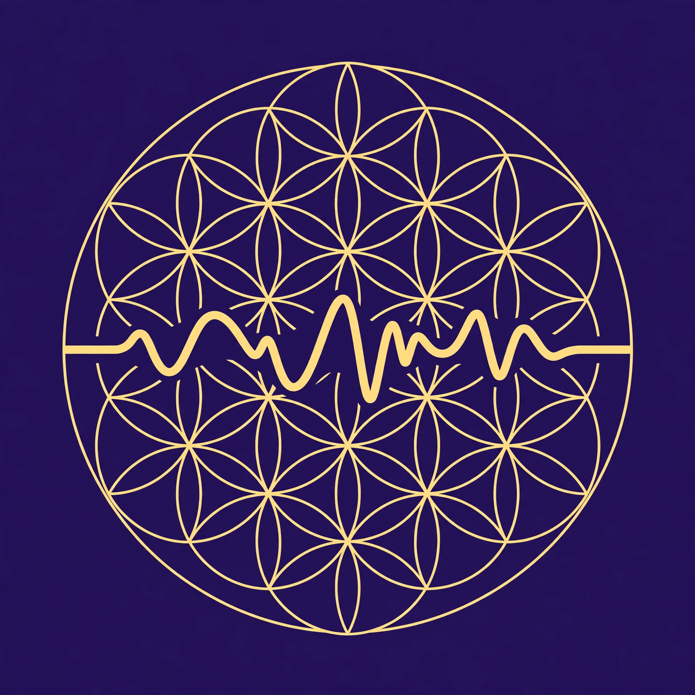

# RESONANCE v0.1.0 — The Generative Heart



Johnathan 'Qasparr' (Κασπάρρ) Monroe, Keeper of the Secret Treasure
All Rights Reserved, Without Prejudice · CashApp $axoneme
SPDX-License-Identifier: AGPL-3.0-only

RESONANCE is a generative audio engine: binaural entrainment tones,
808 drum synthesis, ABC-notation music, headless sacred-geometry
visuals, a plugin system, a render-job HTTP API, and real
measurements. Every pillar installs standalone — the library never
demands the whole world.

## Install

```sh
pip install .                        # core audio conventions only
pip install .[binaural]               # entrainment-tone generator
pip install .[synth]                  # 808 synth + step sequencer
pip install .[abc]                    # ABC notation parse/save/render
pip install .[viz]                    # headless mandala frame engine
pip install .[plugins]               # plugin lifecycle + hooks
pip install .[edit]                   # waveform editing primitives
pip install .[api]                    # FastAPI render-job service
pip install .[full]                   # everything
```

The only runtime dependency is numpy. PNG/MP4 rasterizers (viz),
fastapi/uvicorn (api) stay optional behind lazy imports: importing
`resonance` never requires them, and each backend degrades loudly
(never silently) when absent.

## Quickstart

```python
from resonance.binaural.generator import binaural_beat
from resonance.diagnostics.verify import verify_binaural

# 10 Hz alpha on a 528 Hz carrier, 60 s stereo
audio = binaural_beat(10.0, carrier=528, duration=60.0, sample_rate=44100)

# FFT-verify the render: L and R peak at 523/533 Hz, difference = beat
verdict = verify_binaural(audio, 10.0, 528)
assert verdict["passed"]            # {"peak_l_hz", "peak_r_hz", "beat_measured_hz", ...}

from resonance.synth import render_pattern
# 16 steps per bar; values > 0 are hits (value = velocity)
audio = render_pattern(
    {"kick":       [1,0,0,0, 1,0,0,0, 1,0,0,0, 1,0,0,0],
     "snare":      [0,0,0,0, 1,0,0,0, 0,0,0,0, 1,0,0,0],
     "closed_hat": [1]*16},
    bpm=128.0, bars=1, swing=0.0, sr=44100,
)

from resonance.abc import parse_abc, render_tune
from resonance.abc.tunes import BUILTIN_TUNE
tune = parse_abc(BUILTIN_TUNE)       # "The North Gate", built in
audio = render_tune(tune, path="north-gate.wav", sr=44100)

from resonance.viz.engine import phase_at, render_rosette_frame
phase = phase_at(10.0, t=0.5)        # (beat_hz * t) % 1.0
svg = render_rosette_frame(phase, petals=12, rings=3, beat_hz=10.0)
# each frame's rotation == 2*pi*phase, stamped as data-rotation-rad
```

Or run the end-to-end demo (exit 0 = everything held):

```sh
python3 demo/resonance_demo.py
```

Serve the render-job API:

```sh
pip install .[api]
resonance-serve --port 8765          # POST /jobs/render, GET /jobs/{id}/download
```

## Module map

| Module | What it is | Tests |
|---|---|---|
| `resonance/core` | audio conventions, WAV I/O, note/frequency utils, Solfeggio data, editing primitives (trim/split/splice/mix/fades/normalize/biquad EQ/soft limiter) | test_core, test_edit |
| `resonance/binaural` | entrainment generator (binaural/monaural/isochronic), session scripts, adaptive BPM | test_binaural |
| `resonance/synth` | 808 drum voices + step sequencer | test_synth |
| `resonance/abc` | ABC notation: parse, write, render, built-in tune "The North Gate" | test_abc |
| `resonance/viz` | headless mandala frame engine (stdlib SVG) + optional PNG/MP4 backends | test_viz |
| `resonance/plugins` | plugin discovery, lifecycle, hook registry | test_plugins |
| `resonance/api` | render-job HTTP service (FastAPI, lazy import) | test_api |
| `resonance/diagnostics` | real throughput benchmarks + FFT verification | test_diagnostics |

Run all suites (script-style; a failure raises, the first red line is
the diagnosis):

```sh
for t in tests/test_*.py; do python3 "$t"; done
```

## Honesty

- No medical or therapeutic efficacy is claimed anywhere — not for
  entrainment tones, brainwave-band labels, Solfeggio frequencies, or
  the visuals. Bands are folk-taxonomy names for frequency ranges;
  the mandala frames are aesthetic visual correlates, not treatment.
- Adaptive BPM is a **labeled heuristic**, not a measurement. It is in
  the library, documented as such, and the demo makes no claim about it.
- The API's Bearer-token auth is **PROTOTYPE-GRADE**: static tokens in
  the source, no hashing, no expiry, no per-user isolation. It proves
  the enforcement point (Bearer → role → gate); it is not production
  security. Documented in the service docstring and repeated here.
- The `/diagnostics/benchmark` endpoint runs a real
  `time.perf_counter` measurement — a stub would fail the build.

## Command-line tools

Every module is also an executable — install the extra and the tool
lands on PATH:

| Command | Extra | What it does with no args |
|---|---|---|
| `resonance-binaural` | `[binaural]` | 10 Hz alpha on 528 Hz → `binaural.wav` |
| `resonance-808` | `[synth]` | built-in 808 groove → `pattern.wav` |
| `resonance-abc` | `[abc]` | "The North Gate" tune → `north-gate.wav` |
| `resonance-viz` | `[viz]` | mandala SVG frames → `frames/` |
| `resonance-diag` | (any) | real throughput benchmarks → stdout |
| `resonance-edit` | (any) | fades/limiter/normalize on a demo tone → `edited.wav` |
| `resonance-serve` | `[api]` | serves the render-job API (`--help` works without fastapi) |

Every CLI exits 0 on success, 2 on bad arguments, 1 on failure with
the error printed. Exercised by `tests/test_cli.py` (subprocess,
`python -m resonance.<mod>.cli`, real artifacts asserted).

## Roadmap

- **v0.1.0** (this release): the generative heart — everything above.
- **SaaS later**: `docs/saas-roadmap.md` — the v0.1.0 API ships with
  isolated seams (queue, storage, auth) and the SaaS milestones
  (metered billing, multi-tenancy, async workers) are explicitly
  marked LATER. The seams are the deliverable, not the SaaS.
- **v0.2.0**: the player half — daily-driver suite on this engine.
  Specified in `docs/roadmap.md`, including the `resonance/rip/`
  CD-ripping spec (honestly labeled transcription, never silent
  guessing) and the `docs/skin-contract.md` v0.2.0 UI contract.
- **v0.3.0**: the studio shell — the multitrack timeline editor UI
  (primitives already shipped in `core/edit.py`) plus the
  `resonance/burn/` disc-burning and DVD-Video authoring spec
  (honest backend orchestration — never a fake "burn").

No skinnable player exists yet: `docs/skin-contract.md` is a contract
for the v0.2.0 UI, not a description of shipped software.
